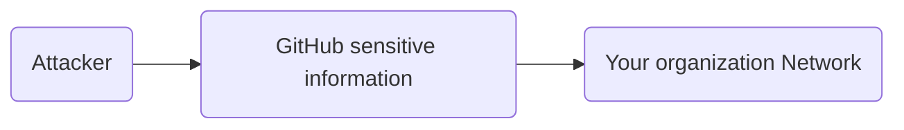

# Welcome to our Inter-america-cyber-challenge!

Hi! This challange intents to show the risk on publish sensitive information on **GitHUB** or another share platform. Using basic OSINT techniques an attacker will be able to retrive data that can help him to access your organization .

# Data

You need to look for sensitive information on our repository and use it to retrive the FLAG.
